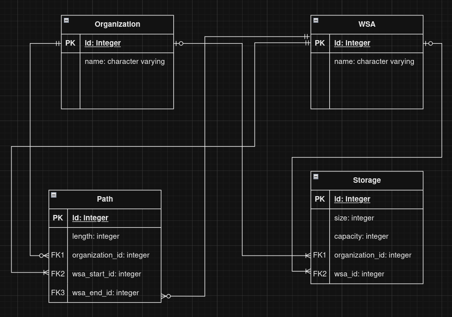
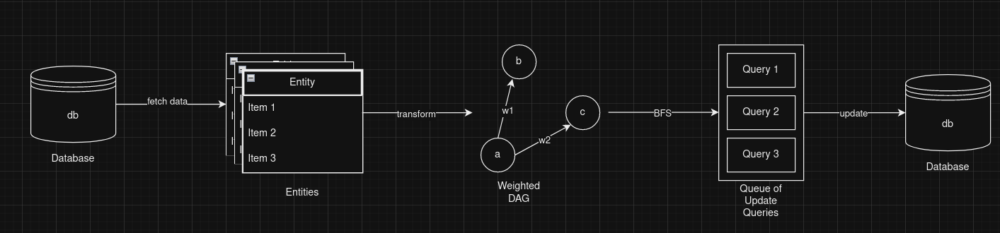

# Тестовое задание 1 (backend)

Выполнил:

---

# Содержание

1. [Описание разработанного API]()
    - [Общее описание]()
    - [Краткое описание доступных функций]()
2. [Даталогичесая модель базы данных]()
3. [Логика работы transfer_waste]()
4. [Инструкция по запуску]()
    - [Вне docker]()
    - [Внутри docker]()
5. [Инструкция по использованию]()
5. [Замечания]()

## Описание разработанного API

### Общее описание

Данный API представляет из себя систему учета отходов атом эко, включающее две основные сущности:
1. **Организация** (ОО) - сущность, генерирующая различные отходы.
2. **Хранилище** (МНО) - место, где происходит накопление и сортировка отходов.

**Хранилище** может принимать и хранить только те виды отходов, для которых оно специально оборудовано. При этом их может быть несколько:

- биоотходы
- стекло
- пластик

**Организация** может генерировать разные виды отходов:
- биоотходы
- стекло
- пластик

Максимальный запас на каждом **Хранилище** ограничен на уровне вида отхода. При достижении максимального запаса, **Хранилище** более не принимает отходы.
Каждой **Организации** доступна информация о расстоянии и оставшемся запасе любого **Хранилища**.
Все отходы **Организаций** могут быть переработаны (если есть доступное **Хранилище**)
При передаче отходов выбирается ближайшее **Хранилище**

API разработан на **FastAPI**, локальная БД - **SQLite**, контейнерная БД - **PostgreSQL**

### Краткое описание доступных функций
`/script` (POST) - endpoint функции, генерирующей систему ОО/МНО, показанную в условии задания. Необходимо использовать только 1 раз

`/api`
Функции, необходимые для работы с разработанным API (основная логика работы)
- `/transfer_waste` (POST) - endpoint функции, реализующей перенос отходов из **Организации** в ближайшее подходящее **Хранилище**
- `/generate_waste` (POST) - endpoint функции, реализующая генерацию отходов в выбранной **Организации**
- `/recycle_waste` (POST) - endpoint функции, реализующая переработку отходов в выбранном **Хранилище**

`/api/internal`
Функции, необходимые для детальной работы с конкретными сущностями API, а так же для возращения списков сущностей
- `/organizations` (GET) - endpoint функции, возвращающей все объекты ОО
- `/organizations` (POST) - endpoint функции, создающей объект ОО
- `/wsas` (GET) - endpoint функции, возвращающей все объекты МНО
- `/wsas` (POST) - endpoint функции, создающей объект МНО
- `/storages` (GET) - endpoint функции, возвращающей все объекты хранилищ
- `/storages` (POST) - endpoint функции, создающей объект хранилища
- `/storages/{storage.id}/size` (PATCH) - endpoint функции, изменяющей размер хранилища
- `/paths` (GET) - endpoint функции, возвращающей все объекты путей
- `/paths` (POST) - endpoint функции, создающей объект пути

Более подробную документацию можно посмотреть на endpointe /docs в **Swagger UI**

## Даталогическая модель базы данных

Указанная в задании терминология показалась мне неоднозначной, поэтому с этого момента буду использовать следующую:
- **ОО (Organization)** - организация
- **МНО (WSA)** - место накопления отходов
- **Хранилище (Storage)** - собственно, склад отходов конкретного типа. ОО и МНО имеют доступ к нескольким таким складам
- **Путь (Path)** - путь, соединяющий ОО и МНО (или же два МНО)

Даталогическая модель базы данных:


Из каждой ОО может исходить несколько Путей в МНО. Из каждой МНО может исходить несколько Путей в другие МНО. Однако, каждую пару ОО И МНО может соединять только один Путь. Каждую пару МНО может соединять только один Путь.

У каждой ОО может быть несколько Хранилищ. У каждого МНО может быть несколько Хранилищ. Однако Хранилище не может быть привязано к ОО и к МНО одновременно.

## Логика работы transfer_waste


Функция принимает на вход набор параметров - название ОО, тип отходов и кол-во отходов, которое необходимо переместить в ближайшее МНО.

Изначально из базы данных достаются необходимые сущности - МНО, Хранилища, Пути, Организация. Затем по этим данным строится взвешенный граф - вершины графа состоят из ИД МНО, а так же характеристик принадлежащего ему подходящего Хранилища, таких как заполненность/вместительность (если МНО не имеет Хранилища, которое хранит необходимый тип отходов, характеристики ставятся как 0/0). Ребра графа состоят из длины Пути и ИД вершин графа, т.е из ИД МНО (если Путь должен быть связан с Организацией, первое ИД ставится как 0).

Далее, с помощью алгоритма обхода в ширину (Breadth-First Search, BFS) производится построение путей от Организации до всех МНО, и все вершины с длинами путей к ним помещаются в приоритетную очередь для автоматической сортировки по возрастанию (на вершине очереди находится ближайшее МНО).

Далее производится проход по данной очереди и, пока еще есть отходы, которые необходимо переместить, они по возможности перемещаются в выбранные МНО. Если после выполнения операции отходы еще остались, значит, МНО заполнены и больше не принимают отходы.

Реализацию алгоритма можно посмотреть [здесь](/project/app/src/waste_logic/utils.py)

## Инструкция по запуску

### Вне docker
Для запуска API вне контейнера необходимо выполнить следующие команды:
```bash
cd project 
uvicorn app.src.main:app --host 0.0.0.0 --port 8000
```
Это запустит API вне контейнера (можно использовать другие значения port). Убедитесь, что выбранный порт не занят.

### Внутри docker
API поддерживает запуск с помощью `docker-compose`, база данных и API хранятся в отдельных контейнерах. Для запуска необходимо выполнить следующие команды:
```bash
cd project
docker-compose up --build // для первого запуска
```
Для последующих запусков:
```bash
docker-compose up
```
Host и port как у запуска без docker, но их можно изменить. Данные, такие как логин и пароль пользователя БД, хранятся в `.env.` файле (в данном случае он предоставлен). Убедитесь, что порт для API, а так же для базы данных (обычно 5432), не занят.

## Инструкция по использованию
**Шаг 1**: Открыть браузер и перейти по указанному во время запуска адресу.

**Шаг 2**: Перейти на endpoint `/docs`. Пример: `http://0.0.0.0:8000/docs`

**Шаг 3**: Делать задуманное.
Swagger UI предоставляет удобный интерфейс для работы с endpointами, так что разобраться в том, как отправлять запросы, не составит труда. Автодокументация endpointов и валидация присутствуют.

(PS: можно отправлять запросы через `curl`, но данная опция не тестировалась).

## Замечания
- Было бы неплохо добавить unit-тестирование, но сжатые сроки не позволили настроить `pytest`
- Вероятно, в даталогической модели можно изменить сущность `Path`, сделав ее более лаконичной